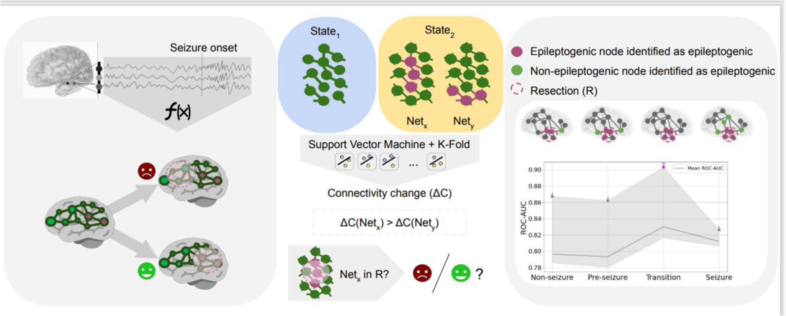

# Epilepsy surgery outcome prediction using a novel EEG marker based on connectivity changes

This is a novel framework that uses cross-validation and machine learning to measure functional connectivity change, enabling epilepsy surgery outcome prediction.

<!-- Graphical abstract -->
<!--  -->

## Publication

> Ivankovic K. et al. — [A novel way to use cross-validation to measure connectivity by machine learning allows epilepsy surgery outcome prediction](https://doi.org/10.1016/j.neuroimage.2024.120990). *NeuroImage* 2025, 306:120990.

## About

The success rate of epilepsy surgery is limited by the lack of reliable epileptogenicity biomarkers. This project introduces a method for quantifying **connectivity change** between network states using machine learning, and applies it to identify surgical resection areas from intracranial EEG recordings.

Rather than relying on specific connectivity variables, the framework tests a general hypothesis: the epileptogenic network (EN) undergoes the greatest magnitude of connectivity change during seizure generation compared to other brain networks. Network states are represented by random snapshots of connectivity within defined time intervals, and a binary classifier's cross-validation performance serves as a continuous measure of connectivity change.

## Highlights

- Novel method to quantify connectivity change using machine learning
- Achieved epilepsy surgery outcome prediction ROC-AUC of **90.3%**
- Seizure transition connectivity as an epileptogenic network (EN) biomarker
- Different combinations of connectivity measures change across time
- Proportional time intervals outperform fixed intervals for identifying the EN

## Quick Start

```bash
git clone https://github.com/principelab/connectivity_change_reproducible
cd connectivity_change_reproducible
conda create -n connectivity python=3.10
conda activate connectivity
pip install -e .
```

## Contributors

Karla Ivankovic — Project lead and primary developer. Responsible for full architecture design, algorithm development, data processing pipelines, testing and validation, and documentation.

Justo Montoya — Contributed utility functions implemented in `connectivity.py`.

Alessandro Principe — Contributed data structures and utility functions across modules in the `src/` directory.
